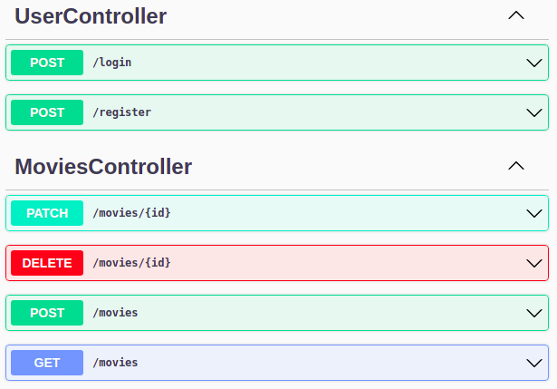
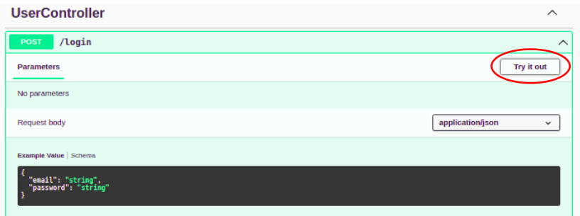
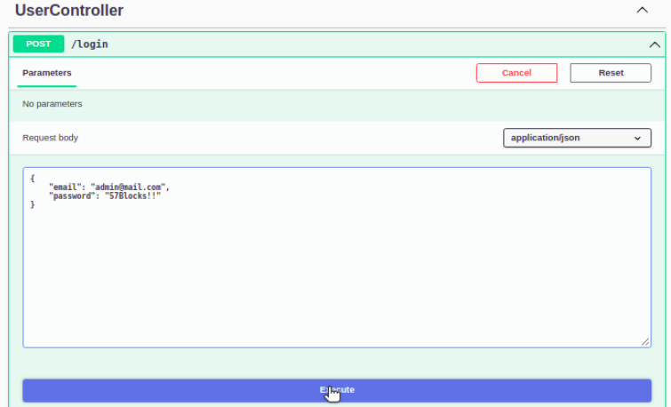
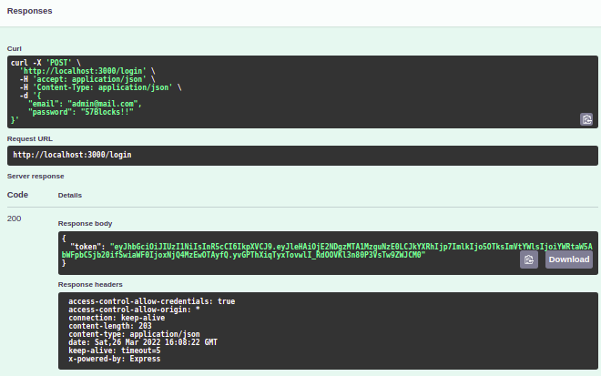
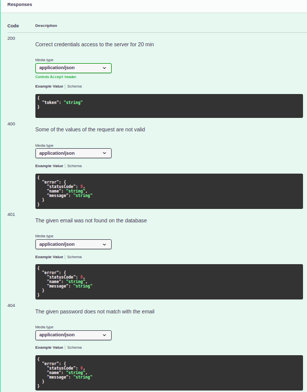
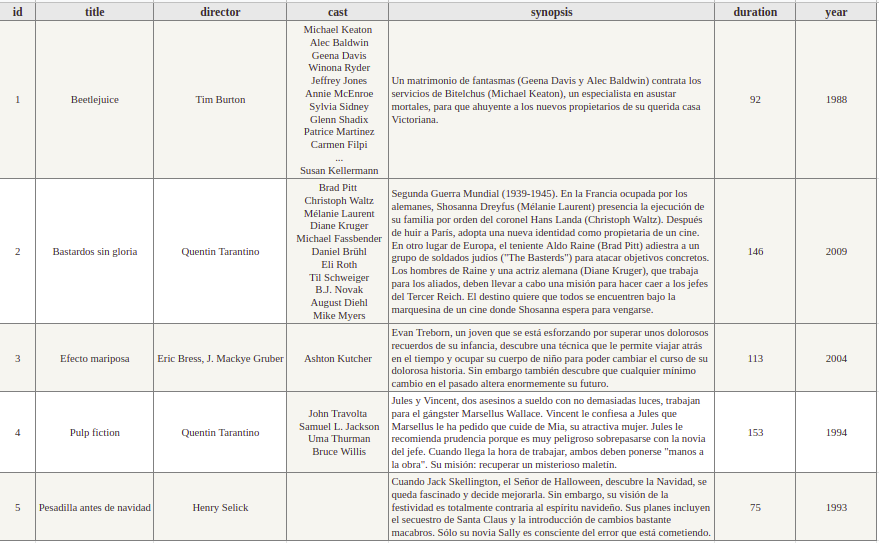

# Movies

This application is generated using [LoopBack 4 CLI](https://loopback.io/doc/en/lb4/Command-line-interface.html) with the
[initial project layout](https://loopback.io/doc/en/lb4/Loopback-application-layout.html).

## Prerequisites
- [Node](https://nodejs.org/en/download/)
- [Loopback](https://loopback.io/doc/en/lb4/Getting-started.html#create-a-new-project)

## Install dependencies and run the project

By default, dependencies were installed when this application was generated.
Whenever dependencies in `package.json` are changed, run the following command inside the `movies` folder:

```sh
npm ci && npm start
```

## Play around

Open [http://127.0.0.1:3000/explorer/](http://127.0.0.1:3000/explorer/) in your browser. there you can find an explorer to test out all endpoints.



All **MoviesController** operations required a `token: string` that you can obtain by passing the following JSON to `/login` endpoint, to edit the example JSON just click on "Try it out" button on the right side.
```
{
    "email": "admin@mail.com",
    "password": "57Blocks!!"
}
```
Or you can create a new user with `/register` to create a different `(email, password)` pair.

Step by step `/login`:



Modify the example JSON for the data shown before.



Then click on "Execute", if the process was successful a new token it's generated that will work for the next 20 min.



Otherwise, there is described all possible responses by `/login`:



For the rest of the endpoint the process is very similar.

- **Note 1:** The `filter` object can be used filter the request in multiple way, in particular to [paginate](https://loopback.io/doc/en/lb4/Skip-filter.html#:~:text=filter%3D%7B%22skip%22%3A3%7D-,Pagination%20Example,-The%20following%20requests) (See **Pagination Example**) using `{ limit, skip }`.

- **Note 2:** For `GET /movies` the `filter` object can go empty `{}` to see the full result without filters.

## Public movies




[-@2x.png)](http://loopback.io/)
